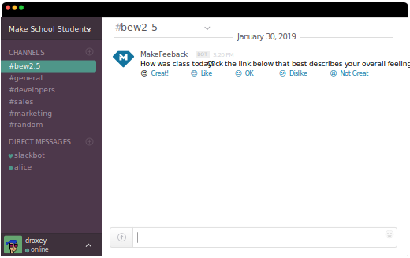

# makefeedback

   

## UX Mockup

## Architecture Diagram

## Dependencies

* [PostgreSQL 11](https://postgresapp.com/)

## Step by Step

1. Implement [Standard Go Project Layout](https://github.com/golang-standards/project-layout).
1. Add simple PostgreSQL schema: `schema/schema.sql`.
1. Add CodeClimate analysis.
